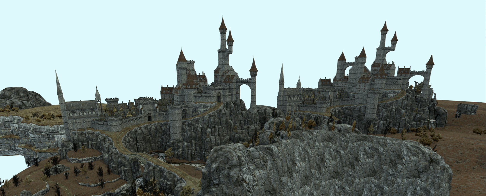
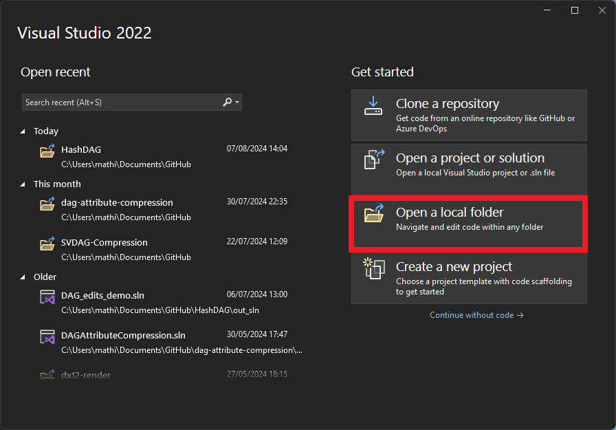

# Editing Compact Voxel Representations on the GPU
This project contains the source code for our paper "Editing Compact Voxel Representations on the GPU" which will be presented at Pacific Graphs 2024.
We extend [the HashDAG framework by V. Carreil, M. Billeter and E.Eisemann](https://github.com/Phyronnaz/HashDAG) by adding a GPU based editing back-end.
This allows large edit operations to be performed at real-time frame rates.

<center></center>

## Building
You will need to install the latest CUDA release as well as the [vcpkg package manager](https://vcpkg.io/en/getting-started.html).

### Windows
Install [Visual Studio 2022](https://visualstudio.microsoft.com/vs/) and the [CUDA Toolkit](https://developer.nvidia.com/cuda-toolkit).

To install `vcpkg`, open Command Prompt and navigate to the folder where you want to install `vcpkg`. Then run the following commands:
```bash
git clone https://github.com/microsoft/vcpkg.git
cd vcpkg
.\bootstrap-vcpkg.bat
.\vcpkg.exe integrate install
```

Now open the root folder of this (SVDAG editing) project using the "Open a local folder" option in Visual Studio:
<center></center>

### Linux
Install CMake, a C++20 compatible compiler, and the [CUDA Toolkit](https://developer.nvidia.com/cuda-toolkit).

To install `vcpkg`, open Terminal and navigate to the folder where you want to install `vcpkg`. Then run the following commands:
```bash
git clone https://github.com/microsoft/vcpkg.git
cd vcpkg
./bootstrap-vcpkg.sh
./vcpkg integrate install
```

This last step will print a message like:
```bash
CMake projects should use: "-DCMAKE_TOOLCHAIN_FILE=/path/to/vcpkg/scripts/buildsystems/vcpkg.cmake"
```

You are now ready to build the project. Navigate to the root folder of this project (SVDAG editing) in terminal and run the following commands. Replace `-DCMAKE_TOOLCHAIN_FILE=...` by the instructions returned by `./vcpkg integrate install` in the previous step.
```bash
mkdir out
cd out
cmake -DCMAKE_BUILD_TYPE=RelWithDebInfo -DCMAKE_TOOLCHAIN_FILE=/path/to/vcpkg/scripts/buildsystems/vcpkg.cmake ../
cmake --build .
```


## Running
At the start of the pogram, it tries to load an existing SVDAG from a `data` folder inside the root of this repository. **Create a `data` folder and place an existing HashDAG file there**. The SVDAGs used in our paper are provided by Phyronazz and can be downloaded here:
https://drive.google.com/drive/folders/1sIYzKSAmOoMA9sfqzkpkF_LiN2HYKxxp?usp=sharing

Compressed DAGs with colors can be created from meshes using the tool from Dan Dolonius: https://github.com/gegoggigog/DAG-example/tree/compression
Some additional work has been done by Phyronnaz in this fork: https://github.com/Phyronnaz/DAG_Compression

The HashDAG files must be converted into our GPU SVDAG format. This can be a length process, especially when importing colors (which are converted to materials). One can cache the results for subsequent runs by setting `#define SAVE_SCENE 1` in `src/configuration/script_definitions.h` (see below). This will output the cache file to the `data` folder. To actually view the generated cache file, run the code again with `#define SAVE_SCENE 0`.

### Memory Allocator
We found that CUDA malloc causes some slow-downs compared to using a custom memory allocator. We use [Vulkan Memory Allocator](https://gpuopen.com/vulkan-memory-allocator/) to perform sub-allocations from a single large `cudaMalloc` allocation performed at start-up.  Vulkan Memory Allocator is enabled by default, but can be disabled with the following CMake option: `-DENABLE_VULKAN_MEMORY_ALLOCATOR=0`.

### Settings
The program is completely configured through compile time definitions. The default parameters are defined in `typedefs.h`.

It is recommended to override them in `src/configuration/script_definitions.h`.
```c++
#pragma once
#include "hash_dag_enum.h"

#define SCENE "epiccitadel" // The name of the scene to load at start-up (see data folder)
#define SCENE_DEPTH 17 // The number of SVDAG levels of the scene.
#define SAVE_SCENE 0 // Loading a scene requires an expensive color => material conversion step. Store the result (in the data folder) to accelerate subsequent loads.

#define DAG_TYPE EDag::MyGpuDag // The type of DAG: static, the HashDAG, or our editable GPU DAG.
#define EDITS_ENABLE_COLORS 1 // Whether to the colors associated with the SVDAG file (applicable to all DAG types).
#define EDITS_ENABLE_MATERIALS 1 // Whether to enable materials (our GPU DAG only).

#define USE_REPLAY 0 // Whether to load and play a replay file.
#define REPLAY_NAME "large_edits" // Name of the replay (see replays folder).
#define REPLAY_DEPTH 16 // The number of SVDAG levels when the replay was recorded.

#define AUTO_GARBAGE_COLLECT 0 // Whether to automatically run garbage collection after each edit.
#define UNDO_REDO 1 // Enable undo/redo functionality.
#define ENABLE_CHECKS 0 // Enable debug assertions.
#define CAPTURE_GPU_TIMINGS 1 // Capture GPU timings and display them in the User Interface
#define CAPTURE_MEMORY_STATS_SLOW 0 // Capture additional statistics about memory usage; may slow down performance.
```

Settings related to *just* the GPU editing pipeline are found in `src/configuration/gpuhash_dag_definitions.h`:
```c++
#pragma once
#include "hash_dag_enum.h"

#define TARGET_LOAD_FACTOR 96 // Determines the number of buckets in the hash table. Targets 96 items per bucket for the initial SVDAG.
#define HASH_TABLE_WARP_ADD 1 // Use warps to insert items into the hash tables (rather than individual threads)
#define HASH_TABLE_WARP_FIND 1 // Use warps to search items in the hash tables (rather than individual threads)
#define HASH_TABLE_ACCURATE_RESERVE_MEMORY 1 // Editing will grow the SVDAG; requiring more memory. Grow the allocators by counting how many nodes/leaves are created of each particular size.
#define HASH_TABLE_TYPE HashTableType::CompactAccelerationHash // The type of hash table used.
#define HASH_TABLE_HASH_METHOD HashMethod::SlabHashXor // The hash function to use; see `src/dags/my_gpu_dags/gpu_hash_table_base.h`.
#define HASH_TABLE_STORE_SLABS_IN_TABLE 1 // Store a contiguous array containing the first slab of each bucket, rather than pointers to the first slab.
#define HASH_DAG_MATERIAL_BITS 4 // The number of bits used to encode a material.
```

### Profiling
The project contains profiling code to measure both CPU & GPU performance (see `src/stats.cpp`); which is how the results in the paper were obtained. The outputs of the profiler is configured through `src/configuration/profile_definitions.h`:
```c++
#pragma once
#include "hash_dag_enum.h"

#define PROFILING_PATH "/path/to/profile/folder/" // Folder where to output profiling results.
#define STATS_FILES_PREFIX "name_of_profile" // Filename for profiling run-time performance.
#define CONSTRUCT_STATS_FILE_PATH "name_of_profile-construction" // Filename for profiling initial SVDAG construction (e.g. memory usage).
```

The code is also instrumented for [Tracy profiler](https://github.com/wolfpld/tracy). 


## Code Structure
Most of the code structure remains unchanged from the [HashDAG framework](https://github.com/Phyronnaz/HashDAG).

| File / Folder                                                            | Functionality                                                                                 |
|--------------------------------------------------------------------------|-----------------------------------------------------------------------------------------------|
| `src/tracer.cu`                                                          | Rendering                                                                                     |
| `src/dags/my_gpu_dags/my_gpu_hash_dag/my_gpu_hash_dag_factory.cpp`       | Importing of HashDAG files                                                                    |
| `src/dags/my_gpu_dags/my_gpu_hash_dag/my_gpu_hash_dag.cu`                | GPU SVDAG management                                                                          |
| `src/dags/my_gpu_dags/create_edit_svo.cu`                                | First part of editing: construction a temporary SVO of what the scene should look like        |
| `src/dags/my_gpu_dags/my_gpu_hash_dag/my_gpu_hash_dag_edits.cu`          | Second part of editing: adding the temporary SVO into the SVDAG                               |
| `src/dags/my_gpu_dags/my_gpu_hash_dag/hash_tables/*`                     | GPU hash table implementations                                                                |
| `src/dags/my_gpu_dags/my_gpu_hash_dag/hash_tables/dynamic_slab_alloc.cu` | Implementation of the [SlabAlloc](https://arxiv.org/abs/1710.11246) that can grow dynamically |
